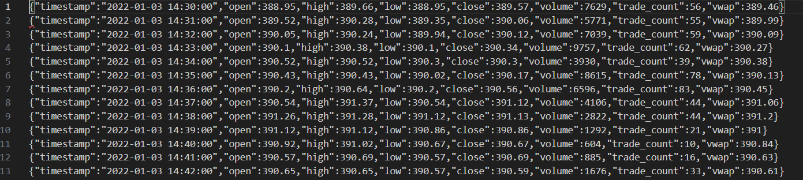
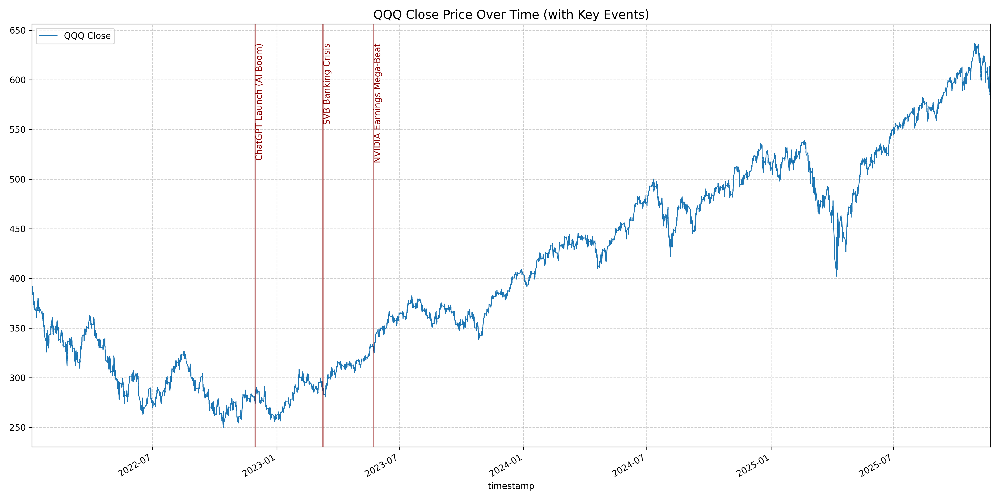
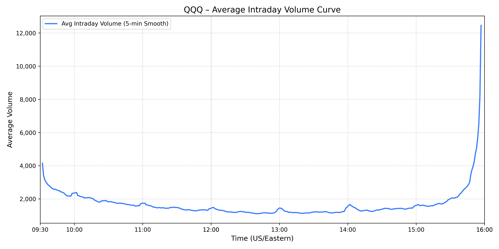
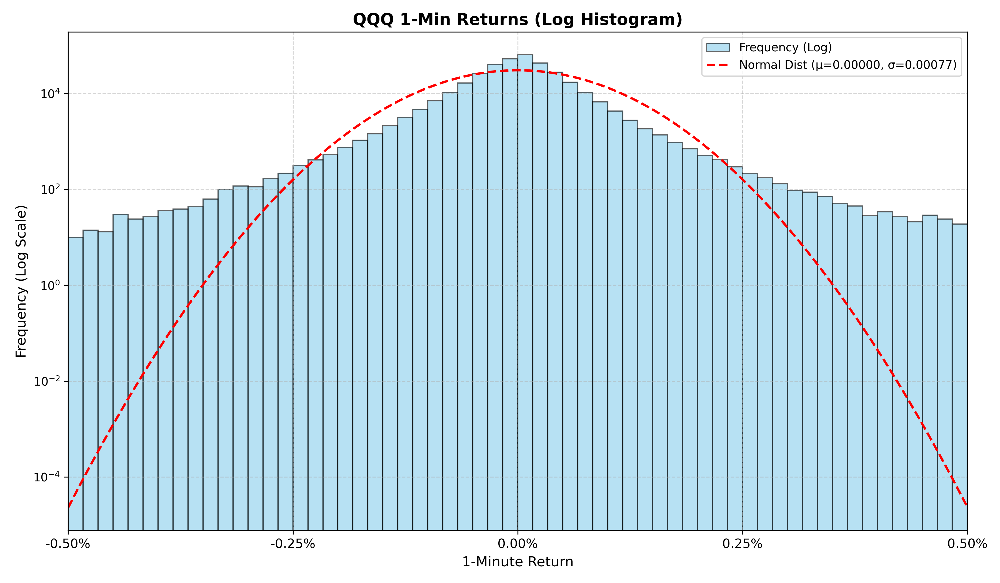
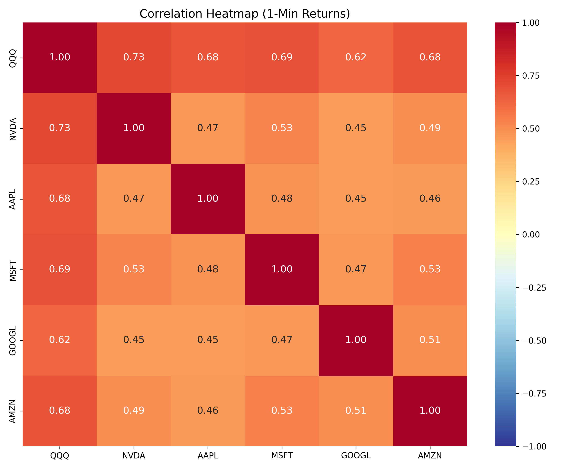

# QQQ Trend Prediction mit Top Tech-Aktien

### Problem Definition:
### Ziel

Vorhersage der Preisrichtung über die nächsten t=[5, 15, 30] Minuten für den Invesco QQQ ETF (QQQ) unter Verwendung der Top 5 Tech-Aktien als Einflussfaktoren.

Für jede Minute vom 2022-01-03 bis zum 2025-11-21 berechnen wir die erwartete Preisveränderung über das zukünftige Fenster t, während wir aktuelle technische Features von sowohl QQQ als auch Top-Tech-Aktien als Input-Predictors verwenden.

### Input Features

*QQQ Technische Features:*
- Normalisierte VWAP und Volumen
- Normalisierte exponentielle gleitende Durchschnitte (EMA) über [5, 10, 20] Minuten
- EMA Differenz (EMA5 - EMA20)
- Kurz- und mittelfristige Returns (5, 15, 30 Minuten)
- Realisierte Volatilität (10 Minuten)

*Top Tech-Aktien Features (NVDA, AAPL, MSFT, GOOGL, AMZN)*:
- Normalisierte VWAP und Volumen für jede Aktie
- EMA über [5, 10, 20] Minuten für jede Aktie
- Kurz- und mittelfristige Returns (5, 15, 30 Minuten) für jede Aktie
- EMA slopes für jede Aktie

*Multi-Asset Relationship Features*:

- Korrelation zwischen QQQ und Tech-Aktien (15 Minuten)
- Relative Stärke (QQQ Performance vs Tech-Durchschnitt)
- Tech Momentum Leader (führende Tech-Aktie identifizieren)

### Verfahrensübersicht:
- Sammelt Minuten-Bars für QQQ und Top 5 Tech-Aktien von 2022-01-03 → 2025-11-21
- Berechnet technische Features für QQQ und vereinfachte Cross-Asset Features
- Sagt Trendrichtung über nächste 30 Minuten vorher mittels Neural Network
- Nutzt Decision Tree zur Identifikation von Entry-Points
- Implementiert Trading-Strategie in Alpaca

**Wir erwarten Muster zu finden, bei denen Tech-Aktien Momentum und Korrelationsänderungen QQQ Trendbewegungen vorausgehen.**

---
## 01 Data Acquisition
Bezieht Rohmarktdaten für QQQ und Top Tech-Aktien von 2022-01-03 bis 2025-11-21, verwendet Alpaca Markets API als exklusive Datenquelle. Die Daten sind gefiltert auf reguläre Handelszeiten.

**Script**

[scripts/01_data_acquisition/01_data_acquisition.py](scripts/01_data_acquisition/01_data_acquisition.py)

Zieht **1-minute** adjustierte bars von **2022-01-03 → 2025-11-21** und schreibt `symbol.parquet` Dateien nach `../trading-board-project/data/raw/QQQ_1m`

**APIs Used**
- Alpaca Markets API v2

**Parameter**
- `symbol`: QQQ, NVDA, AAPL, MSFT, GOOGL, AMZN
- `timeframe`: 1Min (1-Minuten Bars)
- `feed`: iex (kostenloser IEX Daten-Feed mit 15-minütiger Verzögerung) 
- `adjustment`: all (automatische Anpassung für Splits und Dividenden)
- `limit`: 10000
- `start`: 2022-01-03 (Startdatum)  
- `end`: aktuelles Datum (Enddatum)
- `sort`: asc (Sortierreihenfolge, neueste zuerst)

**Datenspeicherung**
- Parquet-Dateien in `../trading-board-project/data/raw/QQQ_1m/`
- Gefiltert für reguläre Handelszeiten
- `columns`: `timestamp`, `open`, `high`, `low`, `close`, `volume`, `trade_count`,`vwap`,   

QQQ Rohdaten Beispiel:

---

## 02 Data Understanding

**QQQ Close Price**

 Zeigt den Close-Preisverlauf von QQQ über die Zeit, inklusive markierter wichtiger Ereignisse wie dem ChatGPT-Launch, der SVB-Krise und starken NVIDIA-Gewinnen.

**Durchschnittliches Intraday-Volumen** 

Zeigt das durchschnittliche Volumen pro Minute von QQQ.

**1‑Minuten-Rendite Histogramm**

Zeigt die Renditeverteilung und Abweichungen von der Normalverteilung.

**Korrelations-Heatmap**

Zeigt die Korrelationen der 1‑Minuten-Renditen zwischen QQQ und Top-Tech-Aktien.

## 03 Pre Split Preperation

**Main Script**

[main.py](scripts/03_pre_split_prep/03_main_prep.py)

**Feature Engineering Script**

[scripts/03_pre_split_prep/03_features.py](scripts/03_pre_split_prep/03_features.py)

**Target Computation Script**

[scripts/03_pre_split_prep/03_targets.py](scripts/03_pre_split_prep/03_targets.py)

**Plotting Script**

[scripts/03_pre_split_prep/03_plot_features.py](scripts/03_pre_split_prep/03_plot_features.py)

### Deskriptive Statistik - Targets

| Zeitraum | count | mean | std | min | 25% | 50% | 75% | max |
|---|---:|---:|---:|---:|---:|---:|---:|---:|
| `target_5m`  | 274,521 | 0.000006 | 0.001839 | -0.053420 | -0.000655 | 0.000035 | 0.000692 | 0.051291 |
| `target_15m` | 274,521 | 0.000024 | 0.003219 | -0.051962 | -0.001144 | 0.000090 | 0.001259 | 0.068575 |
| `target_30m` | 274,521 | 0.000052 | 0.004589 | -0.061669 | -0.001660 | 0.000164 | 0.001871 | 0.071000 |

### Deskriptive Statistik - Features

| Feature | Count | Mean | Std | Min | 25% | 50% | 75% | Max |
|---|---:|---:|---:|---:|---:|---:|---:|---:|
| `close`             | 274,184 | 414.36   | 105.46   | 251.77   | 312.88   | 415.73   | 498.99   | 636.90   |
| `ema_5`             | 274,184 | 414.35   | 105.46   | 251.34   | 312.87   | 415.74   | 498.99   | 636.75   |
| `ema_diff`          | 274,184 | 0.0048   | 0.4454   | -6.3988  | -0.1779  | 0.0211   | 0.2007   | 5.5194   |
| `return_5`          | 274,184 | 0.000007 | 0.001732 | -0.02822 | -0.000654| 0.000035 | 0.000692 | 0.029084 |
| `return_15`         | 274,184 | 0.000022 | 0.002967 | -0.03286 | -0.001143| 0.000089 | 0.001255 | 0.031863 |
| `realized_vol_10`   | 274,184 | 0.000591 | 0.000530 | 0.000023 | 0.000314 | 0.000458 | 0.000678 | 0.009912 |
| `volume_norm`       | 274,184 | 1.0045   | 1.0754   | 0.0161   | 0.3495   | 0.6694   | 1.2432   | 9.9931   |
| `vwap_norm`         | 274,184 | 1.0000   | 0.0003   | 0.9816   | 0.9999   | 1.0000   | 1.0001   | 1.0061   |
| `NVDA_return_5`     | 274,184 | 0.000026 | 0.003832 | -0.04909 | -0.001534| 0.000000 | 0.001621 | 0.048957 |
| `AAPL_return_5`     | 274,184 | 0.000008 | 0.002110 | -0.04969 | -0.000844| 0.000000 | 0.000876 | 0.041113 |
| `MSFT_return_5`     | 274,184 | 0.000008 | 0.001981 | -0.04229 | -0.000803| 0.000020 | 0.000826 | 0.048324 |
| `GOOGL_return_5`    | 274,184 | 0.000014 | 0.002362 | -0.04618 | -0.000974| 0.000000 | 0.000999 | 0.049056 |
| `AMZN_return_5`     | 274,184 | 0.000005 | 0.002651 | -0.04987 | -0.001072| 0.000000 | 0.001092 | 0.049578 |
| `NVDA_volume_norm`  | 274,184 | 1.0216   | 0.9176   | 0.0108   | 0.4576   | 0.7602   | 1.2590   | 9.9993   |
| `AAPL_volume_norm`  | 274,184 | 1.0167   | 0.9210   | 0.0153   | 0.4584   | 0.7568   | 1.2478   | 9.9945   |
| `MSFT_volume_norm`  | 274,184 | 1.0156   | 0.9696   | 0.0175   | 0.4220   | 0.7318   | 1.2525   | 9.9964   |
| `GOOGL_volume_norm` | 274,184 | 1.0169   | 0.9559   | 0.0195   | 0.4371   | 0.7400   | 1.2476   | 9.9918   |
| `AMZN_volume_norm`  | 274,184 | 1.0162   | 0.9310   | 0.0130   | 0.4483   | 0.7525   | 1.2518   | 9.9991   |
| `corr_QQQ_NVDA_15`  | 274,184 | 0.7175   | 0.2644   | -0.9850  | 0.6259   | 0.8021   | 0.9002   | 0.9990   |
| `corr_QQQ_AAPL_15`  | 274,184 | 0.6560   | 0.3315   | -0.9886  | 0.5305   | 0.7702   | 0.8942   | 0.9990   |
| `corr_QQQ_MSFT_15`  | 274,184 | 0.6863   | 0.2986   | -0.9704  | 0.5769   | 0.7883   | 0.8968   | 0.9994   |
| `corr_QQQ_GOOGL_15` | 274,184 | 0.6366   | 0.3282   | -0.9927  | 0.4976   | 0.7443   | 0.8782   | 0.9990   |
| `corr_QQQ_AMZN_15`  | 274,184 | 0.6755   | 0.3038   | -0.9627  | 0.5612   | 0.7779   | 0.8915   | 0.9997   |
| `relative_strength` | 274,184 | 0.0000   | 0.0008   | -0.0123  | -0.0003  | -0.0000  | 0.0003   | 0.0184   |
| `momentum_leader`   | 274,184 | 2.2176   | 1.4891   | 0.0      | 1.0      | 2.0      | 4.0      | 4.0      |

### Sample Features 

