# QQQ Trend Prediction mit Top Tech-Aktien

### Problem Definition:
### Ziel

Vorhersage der Preisrichtung über die nächsten t=[5, 15, 30] Minuten für den Invesco QQQ ETF (QQQ) unter Verwendung der Top 5 Tech-Aktien als Einflussfaktoren.

Für jede Minute vom 2022-01-03 bis zum 2025-11-21 berechnen wir die erwartete Preisveränderung über das zukünftige Fenster t, während wir aktuelle technische Features von sowohl QQQ als auch Top-Tech-Aktien als Input-Predictors verwenden.

### Input Features

*QQQ Technische Features:*
- Normalisierte VWAP und Volumen
- Normalisierte exponentielle gleitende Durchschnitte (EMA) über [5, 10, 20] Minuten
- EMA Differenz (EMA5 - EMA20)
- Kurz- und mittelfristige Returns (5, 15, 30 Minuten)
- Realisierte Volatilität (10 Minuten)

*Top Tech-Aktien Features (NVDA, AAPL, MSFT, GOOGL, AMZN)*:
- Normalisierte VWAP und Volumen für jede Aktie
- EMA über [5, 10, 20] Minuten für jede Aktie
- Kurz- und mittelfristige Returns (5, 15, 30 Minuten) für jede Aktie
- EMA slopes für jede Aktie

*Multi-Asset Relationship Features*:

- Korrelation zwischen QQQ und Tech-Aktien (15 Minuten)
- Relative Stärke (QQQ Performance vs Tech-Durchschnitt)
- Tech Momentum Leader (führende Tech-Aktie identifizieren)

---
## 01 Data Acquisition
Bezieht Rohmarktdaten für QQQ und Top Tech-Aktien von 2022-01-03 bis 2025-11-21, verwendet Alpaca Markets API als exklusive Datenquelle. Die Daten sind gefiltert auf reguläre Handelszeiten.

**Script**

[scripts/01_data_acquisition/01_data_acquisition.py](scripts/01_data_acquisition/01_data_acquisition.py)

Zieht **1-minute** adjustierte bars von **2022-01-03 → 2025-11-21** und schreibt `symbol.parquet` Dateien nach `../trading-board-project/data/raw/QQQ_1m`

**APIs Used**
- Alpaca Markets API v2

**Parameter**
- `symbol`: QQQ, NVDA, AAPL, MSFT, GOOGL, AMZN
- `timeframe`: 1Min (1-Minuten Bars)
- `feed`: iex (kostenloser IEX Daten-Feed mit 15-minütiger Verzögerung) 
- `adjustment`: all (automatische Anpassung für Splits und Dividenden)
- `limit`: 10000
- `start`: 2022-01-03 (Startdatum)  
- `end`: aktuelles Datum (Enddatum)
- `sort`: asc (Sortierreihenfolge, neueste zuerst)

**Datenspeicherung**
- Parquet-Dateien in `../trading-board-project/data/raw/QQQ_1m/`
- Gefiltert für reguläre Handelszeiten
- `columns`: `timestamp`, `open`, `high`, `low`, `close`, `volume`, `trade_count`,`vwap`,   

QQQ Rohdaten Beispiel:

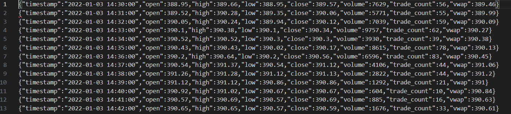

---

## 02 Data Understanding

**QQQ Close Price**

 Zeigt den Close-Preisverlauf von QQQ über die Zeit, inklusive markierter wichtiger Ereignisse wie dem ChatGPT-Launch, der SVB-Krise und starken NVIDIA-Gewinnen.

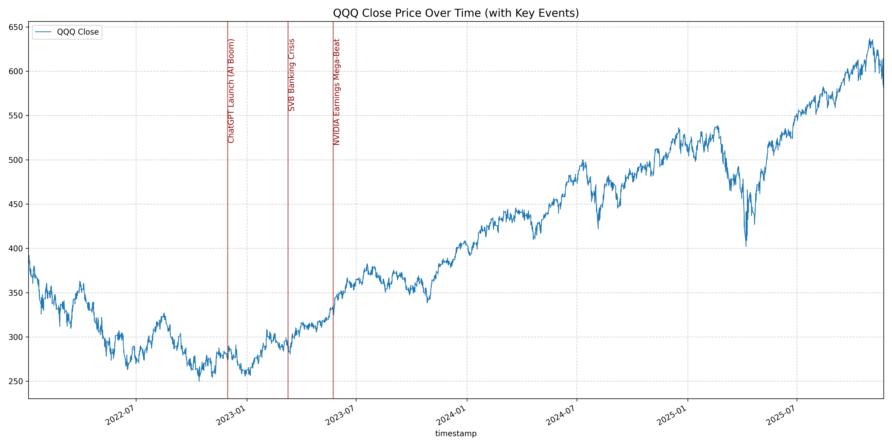

**Durchschnittliches Intraday-Volumen** 

Zeigt das durchschnittliche Volumen pro Minute von QQQ.

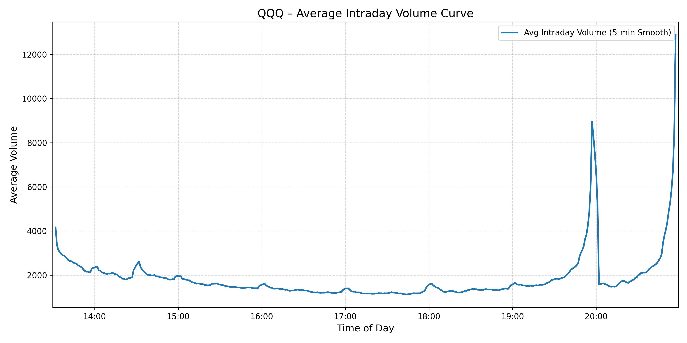

**1‑Minuten-Rendite Histogramm**

Zeigt die Renditeverteilung und Abweichungen von der Normalverteilung.

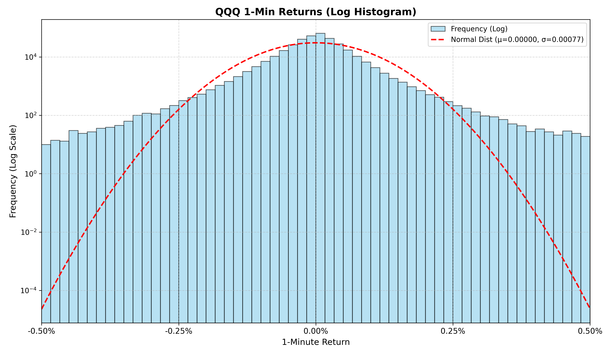

**Korrelations-Heatmap**

Zeigt die Korrelationen der 1‑Minuten-Renditen zwischen QQQ und Top-Tech-Aktien.

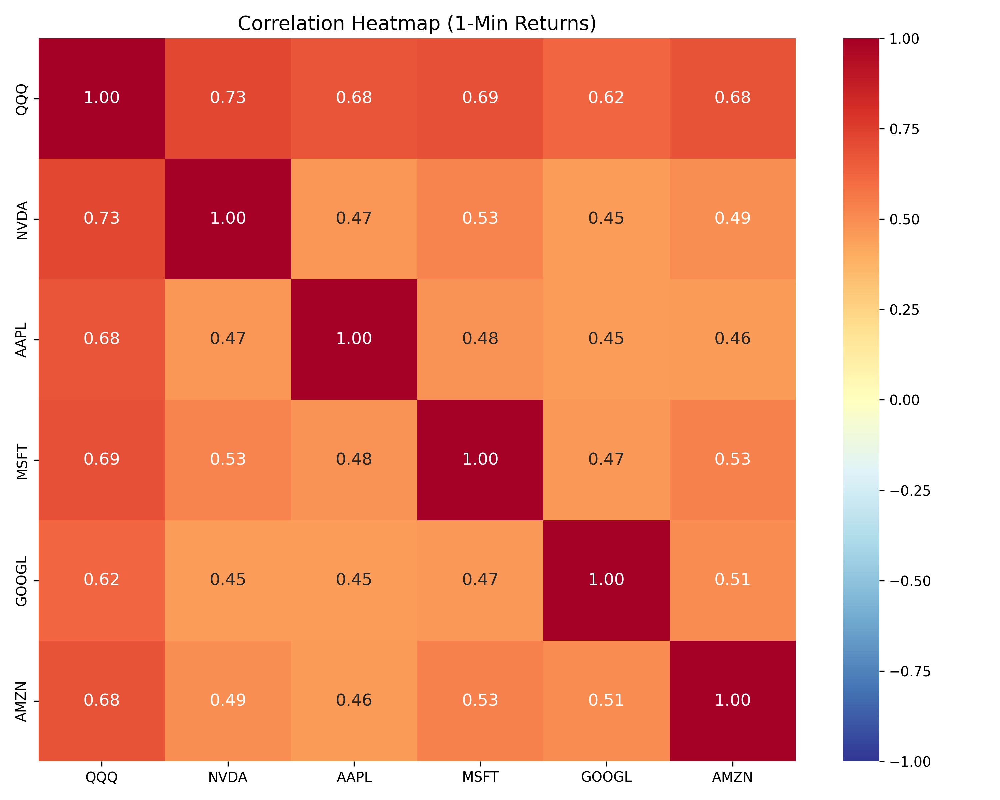

## 03 Pre Split Preperation

**Main Script**

[main.py](scripts/03_pre_split_prep/03_main_prep.py)

**Feature Engineering Script**

[scripts/03_pre_split_prep/03_features.py](scripts/03_pre_split_prep/03_features.py)

**Target Computation Script**

[scripts/03_pre_split_prep/03_targets.py](scripts/03_pre_split_prep/03_targets.py)

**Plotting Script**

[scripts/03_pre_split_prep/03_plot_features.py](scripts/03_pre_split_prep/03_plot_features.py)

**Plots**

**QQQ: EMA(5) vs EMA(20) vs Close**

Vergleicht den Close-Preis mit den beiden exponentiellen gleitenden Durchschnitten (EMA 5 und EMA 20). Zeigt, wie schnelle und langsame Trends sich bewegen und Crossover-Signale entstehen.

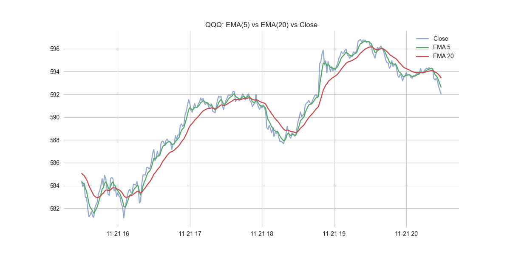

**Scatter: 5‑Min Returns (NVDA vs QQQ) mit Regressionslinie**

Zeigt die Beziehung zwischen 5-Minuten-Renditen von NVDA und QQQ mit Regressionslinie. Der positive Trend deutet auf eine starke positive Korrelation zwischen beiden Assets hin.

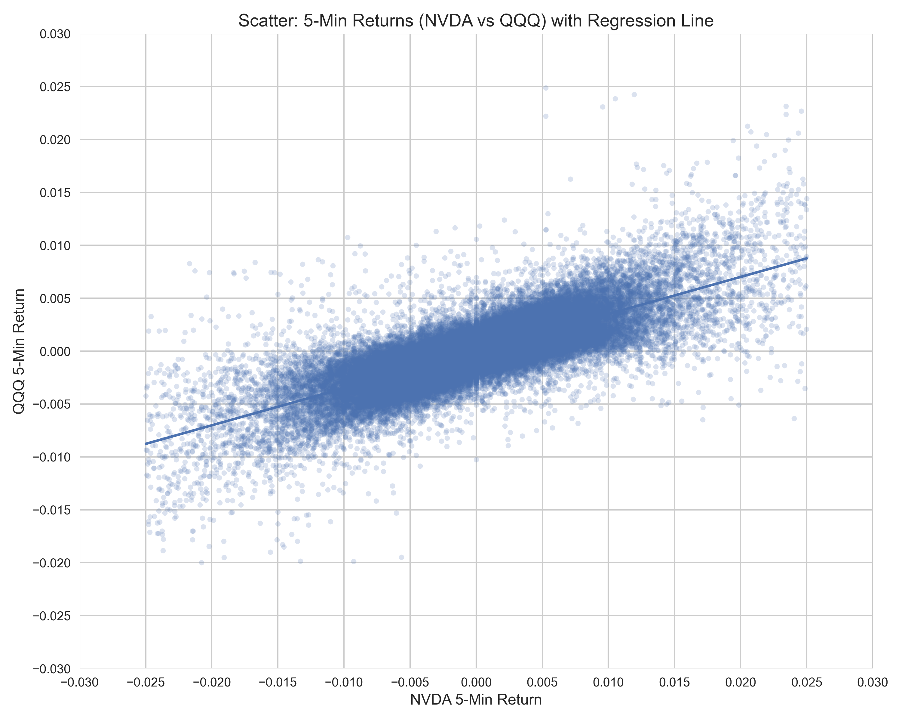

**Rolling 15‑Min Korrelation (QQQ vs NVDA) – Handelszeiten**

Zeigt die zeitlich veränderliche Korrelation zwischen QQQ und NVDA über 15 Minuten während der regulären Handelszeiten. Schwankungen zwischen hoher positiver und negativer Korrelation deuten auf sich ändernde Marktdynamiken hin.

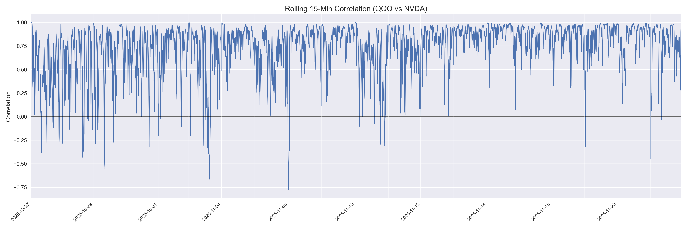

**Divergenz NVDA vs QQQ (5‑Min-Returns)**

Visualisiert die Differenz zwischen NVDA- und QQQ-5-Minuten-Renditen über die Zeit. Positive Ausschläge zeigen NVDA-Überperformance, negative Werte QQQ-Überperformance; nützlich zum Erkennen kurzfristiger Lead/Lag-Muster.

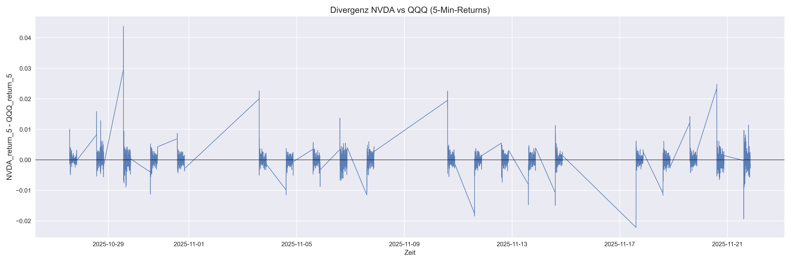

**Momentum-Spread der Tech-Aktien (5‑Min-Returns)**

Zeigt die Standardabweichung (Spread) der 5‑Minuten-Renditen der Tech-Aktien über die Zeit — nützlich, um Perioden erhöhter Dispersion/Momentum innerhalb der Gruppe zu erkennen.

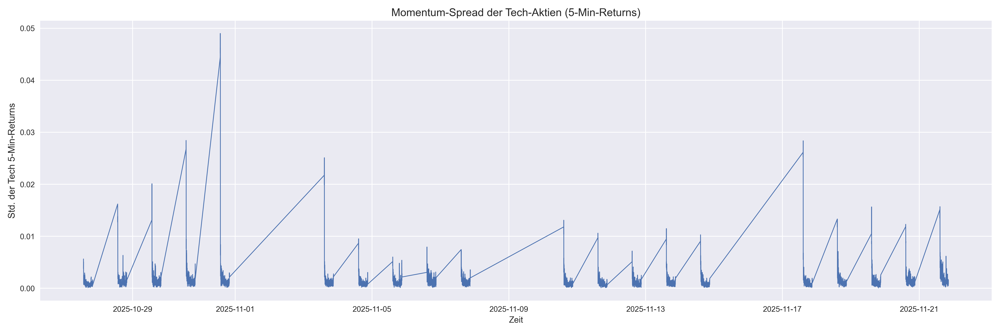

**Divergenz vs. zukünftiger QQQ-Return (5 Min)**

Scatter-Plot, der die Divergenz NVDA vs QQQ (5‑Minuten) gegen den zukünftigen QQQ-Return (5 Min) darstellt. Hilfreich, um zu prüfen, ob Divergenz kurzfristige QQQ-Bewegungen vorhersagt.

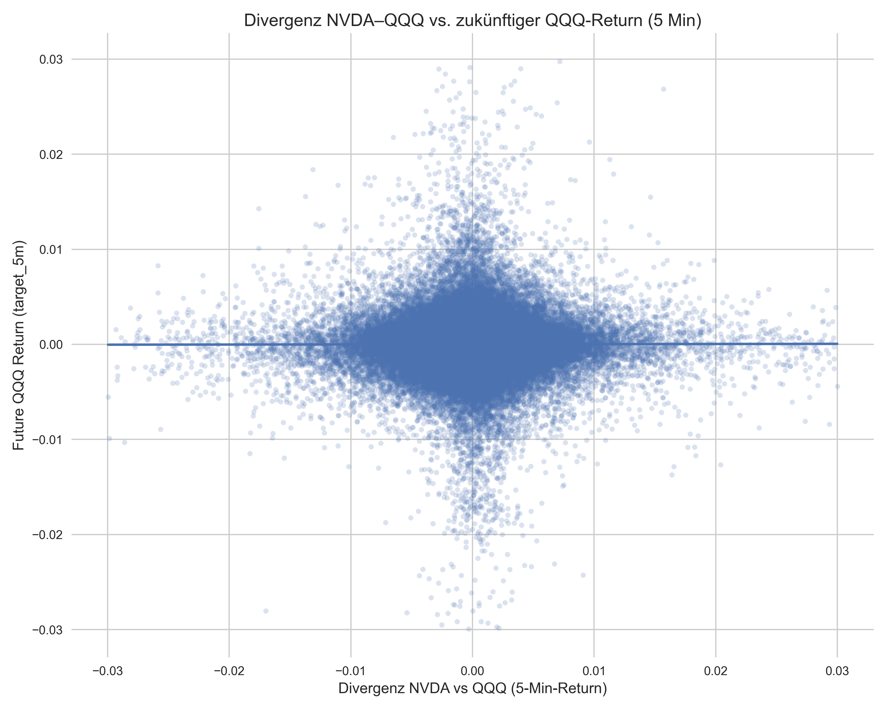

### Deskriptive Statistik - Targets

| Zeitraum | count | mean | std | min | 25% | 50% | 75% | max |
|---|---:|---:|---:|---:|---:|---:|---:|---:|
| `target_5m`  | 274,521 | 0.000006 | 0.001839 | -0.053420 | -0.000655 | 0.000035 | 0.000692 | 0.051291 |
| `target_15m` | 274,521 | 0.000024 | 0.003219 | -0.051962 | -0.001144 | 0.000090 | 0.001259 | 0.068575 |
| `target_30m` | 274,521 | 0.000052 | 0.004589 | -0.061669 | -0.001660 | 0.000164 | 0.001871 | 0.071000 |

### Deskriptive Statistik - Features

| Feature | Count | Mean | Std | Min | 25% | 50% | 75% | Max |
|---|---:|---:|---:|---:|---:|---:|---:|---:|
| `close`             | 274,184 | 414.36   | 105.46   | 251.77   | 312.88   | 415.73   | 498.99   | 636.90   |
| `ema_5`             | 274,184 | 414.35   | 105.46   | 251.34   | 312.87   | 415.74   | 498.99   | 636.75   |
| `ema_diff`          | 274,184 | 0.0048   | 0.4454   | -6.3988  | -0.1779  | 0.0211   | 0.2007   | 5.5194   |
| `return_5`          | 274,184 | 0.000007 | 0.001732 | -0.02822 | -0.000654| 0.000035 | 0.000692 | 0.029084 |
| `return_15`         | 274,184 | 0.000022 | 0.002967 | -0.03286 | -0.001143| 0.000089 | 0.001255 | 0.031863 |
| `realized_vol_10`   | 274,184 | 0.000591 | 0.000530 | 0.000023 | 0.000314 | 0.000458 | 0.000678 | 0.009912 |
| `volume_norm`       | 274,184 | 1.0045   | 1.0754   | 0.0161   | 0.3495   | 0.6694   | 1.2432   | 9.9931   |
| `vwap_norm`         | 274,184 | 1.0000   | 0.0003   | 0.9816   | 0.9999   | 1.0000   | 1.0001   | 1.0061   |
| `NVDA_return_5`     | 274,184 | 0.000026 | 0.003832 | -0.04909 | -0.001534| 0.000000 | 0.001621 | 0.048957 |
| `AAPL_return_5`     | 274,184 | 0.000008 | 0.002110 | -0.04969 | -0.000844| 0.000000 | 0.000876 | 0.041113 |
| `MSFT_return_5`     | 274,184 | 0.000008 | 0.001981 | -0.04229 | -0.000803| 0.000020 | 0.000826 | 0.048324 |
| `GOOGL_return_5`    | 274,184 | 0.000014 | 0.002362 | -0.04618 | -0.000974| 0.000000 | 0.000999 | 0.049056 |
| `AMZN_return_5`     | 274,184 | 0.000005 | 0.002651 | -0.04987 | -0.001072| 0.000000 | 0.001092 | 0.049578 |
| `NVDA_volume_norm`  | 274,184 | 1.0216   | 0.9176   | 0.0108   | 0.4576   | 0.7602   | 1.2590   | 9.9993   |
| `AAPL_volume_norm`  | 274,184 | 1.0167   | 0.9210   | 0.0153   | 0.4584   | 0.7568   | 1.2478   | 9.9945   |
| `MSFT_volume_norm`  | 274,184 | 1.0156   | 0.9696   | 0.0175   | 0.4220   | 0.7318   | 1.2525   | 9.9964   |
| `GOOGL_volume_norm` | 274,184 | 1.0169   | 0.9559   | 0.0195   | 0.4371   | 0.7400   | 1.2476   | 9.9918   |
| `AMZN_volume_norm`  | 274,184 | 1.0162   | 0.9310   | 0.0130   | 0.4483   | 0.7525   | 1.2518   | 9.9991   |
| `corr_QQQ_NVDA_15`  | 274,184 | 0.7175   | 0.2644   | -0.9850  | 0.6259   | 0.8021   | 0.9002   | 0.9990   |
| `corr_QQQ_AAPL_15`  | 274,184 | 0.6560   | 0.3315   | -0.9886  | 0.5305   | 0.7702   | 0.8942   | 0.9990   |
| `corr_QQQ_MSFT_15`  | 274,184 | 0.6863   | 0.2986   | -0.9704  | 0.5769   | 0.7883   | 0.8968   | 0.9994   |
| `corr_QQQ_GOOGL_15` | 274,184 | 0.6366   | 0.3282   | -0.9927  | 0.4976   | 0.7443   | 0.8782   | 0.9990   |
| `corr_QQQ_AMZN_15`  | 274,184 | 0.6755   | 0.3038   | -0.9627  | 0.5612   | 0.7779   | 0.8915   | 0.9997   |
| `relative_strength` | 274,184 | 0.0000   | 0.0008   | -0.0123  | -0.0003  | -0.0000  | 0.0003   | 0.0184   |
| `momentum_leader`   | 274,184 | 2.2176   | 1.4891   | 0.0      | 1.0      | 2.0      | 4.0      | 4.0      |

### Sample Features 

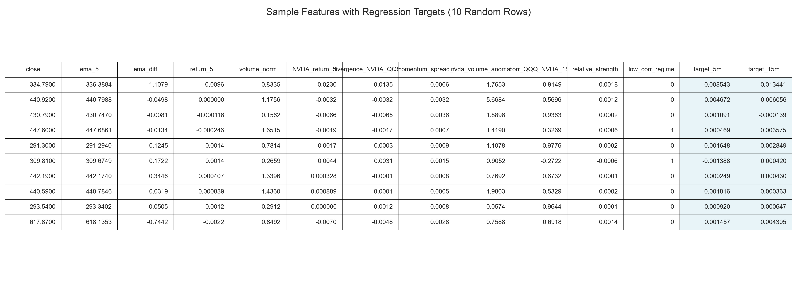

---

## 4 - Data-Split 
**Script**

[split_data.py](scripts/04_split_data/04_split_data.py)

---

## Step 5 - Post-Split Preparation

**Script**

[05_main_post_split.py](scripts/05_post_split_prep/05_main_post_split.py)

Bereitet die gesplitteten Daten für das Modelltraining vor:
1.  **Drop NaNs**: Entfernt Zeilen mit fehlenden Werten (z.B. durch Rolling Windows).
2.  **Separate X/y**: Trennt Features und Zielvariable.
3.  **Scale Features**: Wendet `StandardScaler` auf Features an (Fit auf Train, Transform auf alle).
4.  **Save Numpy**: Speichert optimierte `.npy` Arrays für das Training.

`sample_y_train_unscaled.csv` 

| target_5m | target_15m | target_30m |
|---:|---:|---:|
|-0.002266931141966434 | -0.003938792859166864 | -0.0029470104845564287 |
|-0.0016377649325625913 | -0.0009955041746949336 | -0.0012202954399486046 |
|-0.0009954532002475302 | -0.000726411794775167 | -0.0005111786703973681 |
|9.100837277038454e-05 | 0.003063948549933233 | 0.0023965538162844936 |
|0.0013637668676428204 | -0.0030505311513062227 | -0.009079816250358788 |
|-0.0017200489953349358 | 0.00026061348414172875 | 0.00106851528498091 |
|-0.0017546424915924046 | -0.0013159818686943035 | -0.002120193010674017 |
|-0.0013571826280623133 | 0.0016703786191535402 | -0.00027839643652575487 |

`sample_X_train_unscaled.csv`

| ema_diff | return_5 | volume_norm |
|---:|---:|---:|
|-0.08109537 | 0.00017005 | 1.12348178 |
|-0.10397075 | 0.00118960 | 0.75332398 |
|-0.85181476 | -0.00077961 | 0.50599606 |
|0.09926313 | 0.00042489 | 0.73509672 |
|-0.26607503 | 0.00061048 | 0.12960279 |
|0.42973253 | -0.00078123 | 0.58049487 |

`sample_y_train_scaled.csv`

| target_5m | target_15m | target_30m |
|---:|---:|---:|
|-0.002266931141966434 | -0.003938792859166864 | -0.0029470104845564287 |
|-0.0016377649325625913 | -0.0009955041746949336 | -0.0012202954399486046 |
|-0.0009954532002475302 | -0.000726411794775167 | -0.0005111786703973681 |
|9.100837277038454e-05 | 0.003063948549933233 | 0.0023965538162844936 |
|0.0013637668676428204 | -0.0030505311513062227 | -0.009079816250358788 |
|-0.0017200489953349358 | 0.00026061348414172875 | 0.00106851528498091 |
|-0.0017546424915924046 | -0.0013159818686943035 | -0.002120193010674017 |
|-0.0013571826280623133 | 0.0016703786191535402 | -0.00027839643652575487 |

`sample_X_train_scaled.csv`

| ema_diff | return_5 | volume_norm |
|---:|---:|---:|
|-0.18675001 | 0.07942148 | 0.10852180 |
|-0.23891126 | 0.56327787 | -0.25347719 |
|-1.94417202 | -0.37126816 | -0.49535364 |
|0.22450992 | 0.20036217 | -0.27130269 |
|-0.60854725 | 0.28844060 | -0.86345066 |
|0.97805812 | -0.37203596 | -0.42249689 |

---

## Step 6 – Feature Selection
**Script**

[06_feature_selection.py](scripts/06_feature_selection/06_feature_selection.py)

| feature | target_5m | target_15m | target_30m |
|---|---:|---:|---:|
| **`ema_diff`** | -0.002232 | 0.010529 | 0.008679 |
| **`return_5`** | -0.017092 | -0.006637 | 0.003839 |
| **`realized_vol_10`** | -0.001225 | 0.001799 | -0.009868 |
| **`volume_norm`** | -0.007416 | -0.004843 | -0.005991 |
| **`volume_acceleration`** | 0.000247 | -0.003885 | 0.000079 |
| **`bid_ask_spread_proxy`** | -0.004396 | 0.004960 | 0.006046 |
| **`NVDA_return_5`** | -0.011149 | -0.002574 | 0.009995 |
| **`AAPL_return_5`** | -0.017119 | -0.006983 | 0.000219 |
| **`MSFT_return_5`** | -0.005695 | 0.001526 | 0.002963 |
| **`GOOGL_return_5`** | -0.007035 | -0.000080 | 0.006464 |
| **`AMZN_return_5`** | -0.003732 | 0.001095 | 0.002323 |
| **`tech_unanimity`** | -0.003317 | -0.003101 | -0.003684 |
| **`momentum_spread_5`** | -0.001906 | 0.000633 | -0.005655 |
| **`max_divergence`** | -0.003344 | 0.000295 | -0.006040 |
| **`relative_strength`** | -0.001378 | -0.006223 | -0.006923 |
| **`high_vol_regime`** | 0.005518 | 0.011151 | 0.013137 |
| **`low_corr_regime`** | 0.005488 | 0.006909 | 0.011169 |
| **`overextended_up`** | 0.002577 | 0.008200 | -0.002951 |
| **`overextended_down`** | 0.001600 | -0.012088 | -0.023756 |
| **`corr_QQQ_NVDA_15`** | -0.008101 | -0.011794 | -0.014829 |

---

## 07 Modeling

### 7.1 Feed Forward Neural Network (Multi‑Horizon MLP)

Das in diesem Projekt verwendete Feed‑Forward‑Modell ist ein Multi‑Horizon MLP, das für die Vorhersage der Richtung (Up/Down) für drei Vorhersagehorizonte trainiert wird: 5m, 15m und 30m. Im Unterschied zur ursprünglichen Vorlage handelt es sich hier um ein Klassifikations‑Setup (Richtung).

#### Feed Forward Skript

[scripts/07_modeling/07_feed_forward.py](scripts/07_modeling/07_feed_forward/07_feed_forward.py)

#### Feed Forward Architektur 

- Eingangs‑Dimension: Anzahl der Features in `X_train_scaled.npy`
- Hidden1: 1024 Neuronen
- Hidden2: 1024 Neuronen
- Hidden3: 512 Neuronen
- Hidden4: 512 Neuronen
- Hidden5: 256 Neuronen
- Aktivierung: LeakyReLU
- BatchNorm nach jeder Linear‑Schicht
- Dropout: p = 0.1
- Output: 3 Logits (ein Logit pro Horizont)

#### Visualisierungen
Die Grafik zeigt den Verlauf von **Train- und Validation-Loss** über die Epochen.  
Der Loss sinkt zu Beginn leicht, stabilisiert sich aber schnell in der Nähe von **≈ 0,69**.  
Das entspricht ungefähr dem Loss eines Modells, das konstant eine Wahrscheinlichkeit von 50 % (Münzwurf) vorhersagt.  
→ **Das Feed-Forward-Netz kann nur sehr begrenzt Struktur im Datensatz ausnutzen.**

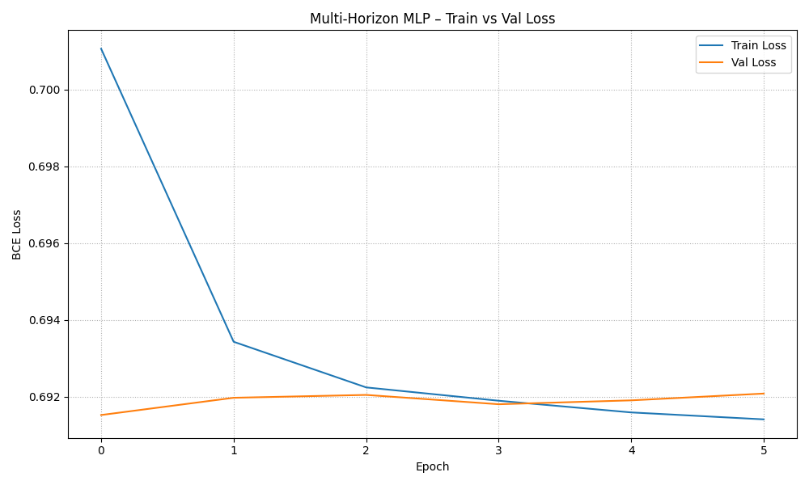

Hier ist die **Test-Accuracy** getrennt nach Zeithorizont dargestellt (5m, 15m, 30m).  
Alle drei Horizonte liegen nur **knapp über 50 %**, also nur minimal besser als zufälliges Raten.

**Schlussfolgerung:**

- Das Feed-Forward-NN liefert zwar eine leichte Verbesserung gegenüber reiner Zufallsentscheidung,
- aber die **Vorhersagequalität bleibt insgesamt schwach**.  
  Die kurzfristige Trendrichtung im QQQ scheint mit den gewählten Features/Labels **nur sehr schwer vorherzusagen** zu sein.

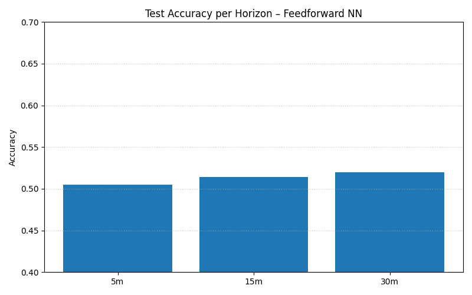

In diesem Plot werden für die ersten Test-Samples die **tatsächliche Richtung (0/1)** als Step-Plot und die  
**vom Modell geschätzte Aufwärts-Wahrscheinlichkeit** dargestellt. Zusätzlich ist unten rechts nochmals der  
Validation-Loss zu sehen.

- Die blaue Linie (Actual 0/1) springt stark zwischen 0 und 1 → typisch für binäre Zeitreihen.
- Die orange Kurve (Predicted Probability) liegt meist nahe bei **0,5** und folgt den Sprüngen nur schwach.
- Die eingeblendeten Test-Accuracies pro Horizont bestätigen das Bild: **nur wenig besser als Zufall**.

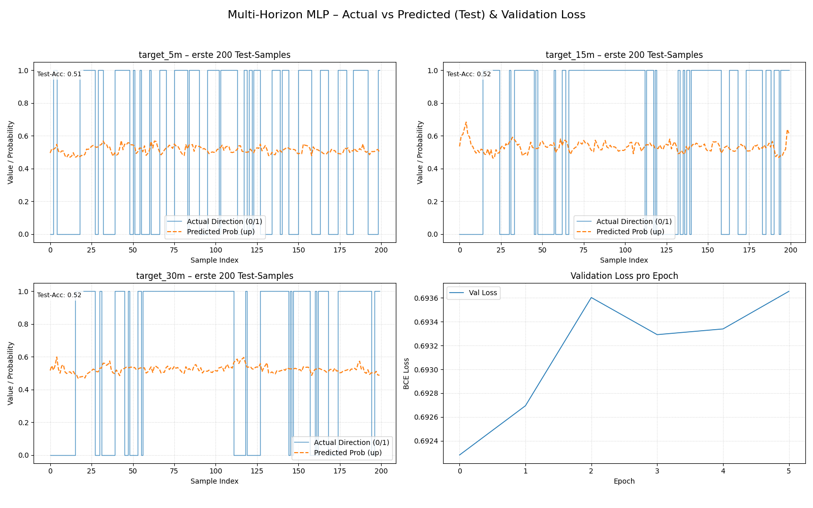

Das Modell dient als **Baseline**. Es zeigt, dass mit einem reinen Feed-Forward-Ansatz und den gewählten Features  
nur ein sehr schwaches Signal für die kurzfristige Trendrichtung erkennbar ist.  

### 6.2 LSTM-Modell (Sequenzmodell)

[scripts/07_modeling/07_lstm.py](scripts/07_modeling/07_feed_forward/07_feed_forward.py)

Als zweites Modell wurde ein **LSTM** eingesetzt, das statt einzelner Zeitpunkte ganze
Sequenzen der letzten 20 Minuten verarbeitet.  
Eingaben sind wieder die skalierten Features, als Zielvariable dienen die
Richtungen der nächsten 5/15/30 Minuten (`target_5m`, `target_15m`, `target_30m`, 0/1).

#### Loss-Verlauf
Der Trainings-Loss sinkt klar ab, während der Validation-Loss bereits nach wenigen
Epochen deutlich ansteigt.  
Das ist ein typisches Zeichen für **Overfitting**:  
Das LSTM passt sich stark an die Trainingssequenzen an, generalisiert aber schlecht
auf die Validierungsdaten.

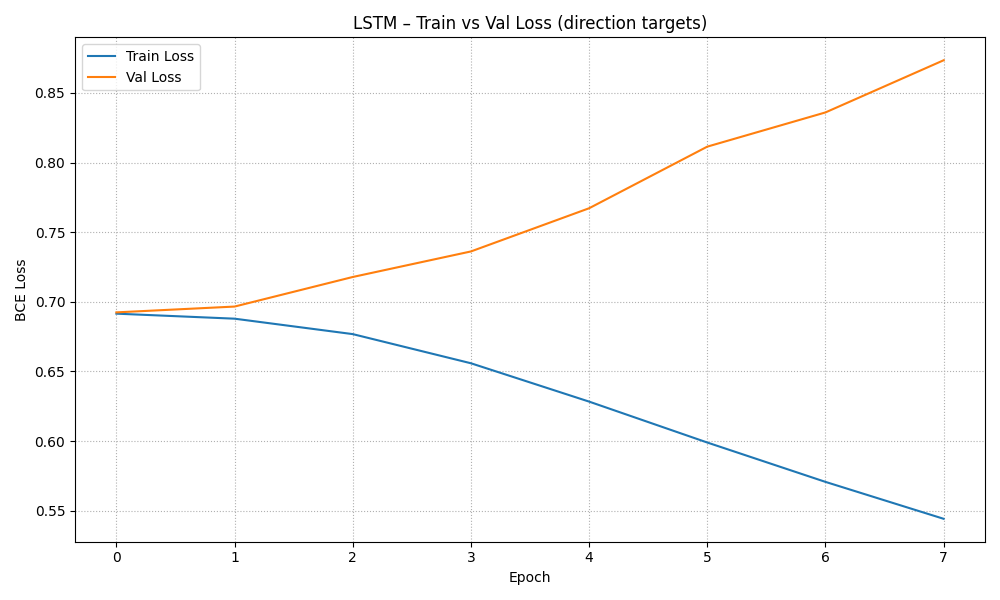

#### Test-Accuracy pro Horizont

Auf dem Test-Set liegt die Accuracy für alle drei Horizonte nur bei **ca. 50–52 %** und
damit praktisch auf dem Niveau des Feed-Forward-Netzes sowie eines Zufallsmodells.

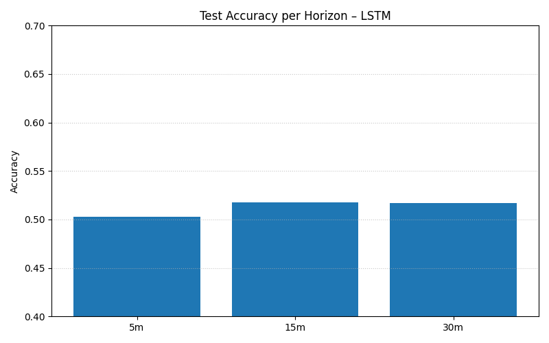

#### Beispiel: Actual vs. Predicted

Die blauen Linien zeigen die tatsächliche Richtung (0/1), die orange Kurve die vom LSTM
geschätzte Aufwärts-Wahrscheinlichkeit.  
Die Vorhersagen liegen überwiegend um **0,5** und folgen den Richtungswechseln nur sehr
schwach – das Modell ist also meist unsicher.

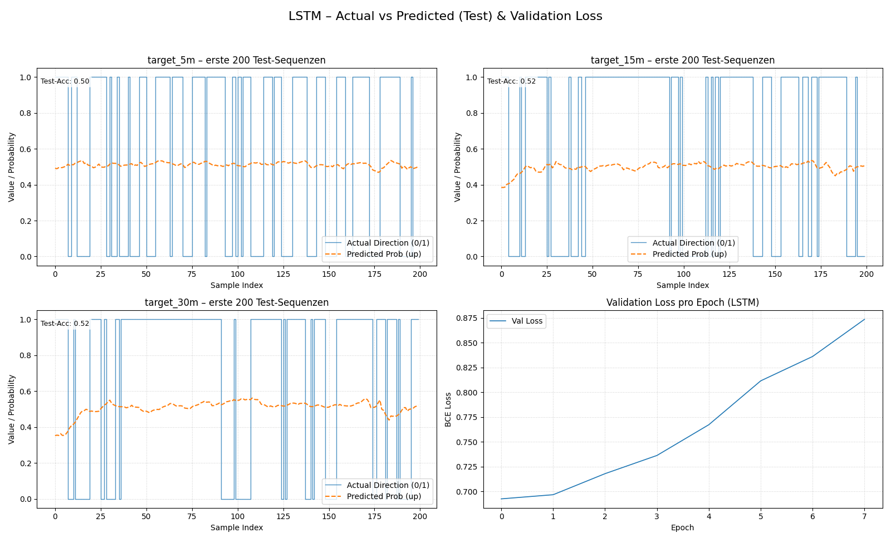

**Fazit LSTM:**  
Trotz expliziter Modellierung der Zeitabhängigkeiten kann das LSTM die kurzfristige
Trendrichtung **nicht zuverlässig** vorhersagen und bietet keinen klaren Vorteil
gegenüber dem Feed-Forward-Baseline-Modell.  
Damit bestätigt sich, dass im betrachteten Datensatz nur ein sehr schwaches
handelbares Signal für die nächsten 5–30 Minuten vorhanden ist.

