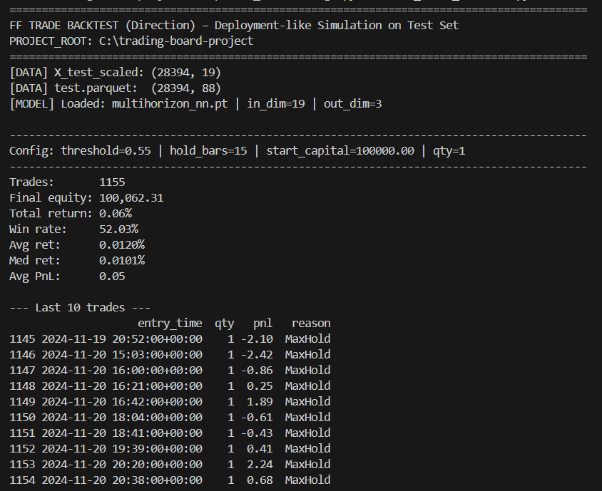
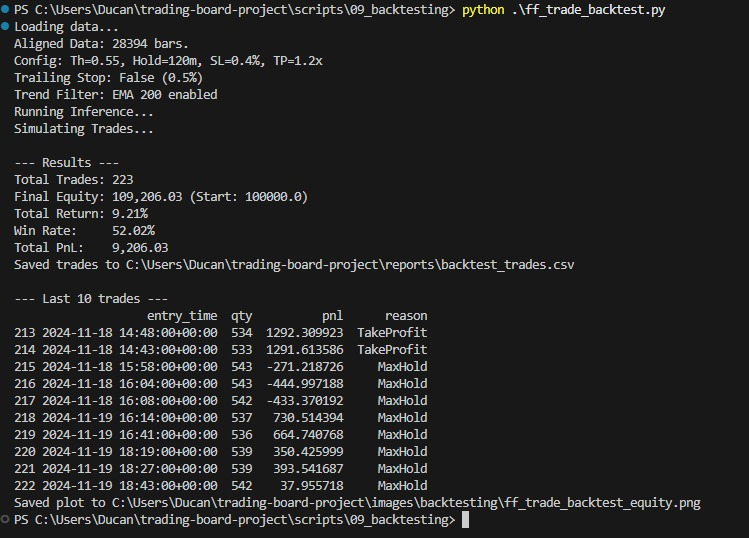
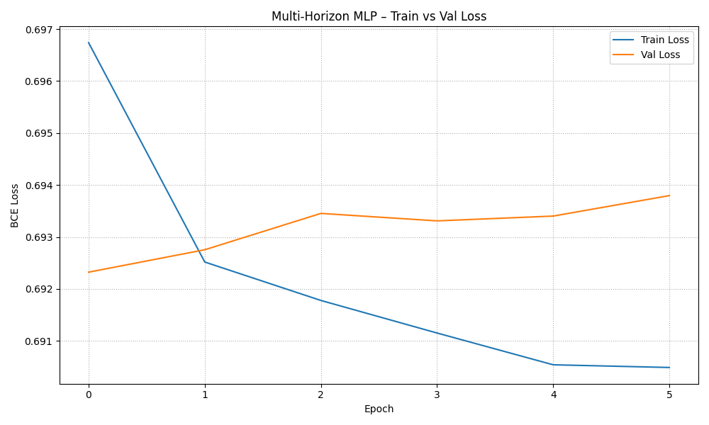

# Iteration 1: Verbesserungen an Deployment und Backtesting mit zentraler Trading Konfiguration
Diese Iteration erhöht den Realismus und die Steuerbarkeit der Trading Logik durch eine zentrale Konfiguration, verbessertes Risiko Management und ein Backtesting, das Stop Loss, Take Profit, Slippage und Gebühren berücksichtigt.

Neben den Änderungen an Deployment und Backtesting wurde `conf/trading.yaml` als gemeinsame Parameterquelle ergänzt. Zusätzlich wurde das Feed Forward Training durch höheres Dropout regularisiert und ein Deployment Vergleich hinzugefügt, um das Verhalten vor und nach der Iteration direkt gegenüberzustellen.

## 1. Zentrale Trading Konfiguration

[conf/trading.yaml](conf/trading.yaml)

*TRADING*
- `SYMBOL`, Asset das gehandelt wird, zum Beispiel `QQQ`
- `PROB_THRESHOLD`, Mindestwahrscheinlichkeit für Entry
- `MAX_HOLD_MINUTES`, maximale Haltedauer je Position in Minuten
- `MAX_POSITIONS`, maximale Anzahl offener Positionen gleichzeitig
- `COOLDOWN_MINUTES`, Pause nach Exit bis neuer Entry erlaubt ist
- `ONE_TRADE_PER_BAR`, pro 1 Minute Kerze maximal ein neuer Trade

*RISK_MANAGEMENT*
- `STOP_LOSS_TYPE`, Stop Loss Logik, zum Beispiel `pct`
- `STOP_LOSS_VALUE`, Stop Loss Größe, zum Beispiel `0.010` für 1.0 Prozent
- `TAKE_PROFIT_TYPE`, Take Profit Logik, zum Beispiel `rr`
- `TAKE_PROFIT_VALUE`, Take Profit als Risk Reward, zum Beispiel `2.0`
- `TRAILING_STOP_ENABLED`, Trailing Stop an oder aus
- `TRAILING_STOP_PCT`, Trailing Stop Abstand in Prozent
- `RISK_PER_TRADE_PCT`, Risiko pro Trade als Anteil vom Konto
- `MAX_NOTIONAL_PCT`, maximale Positionsgröße als Anteil vom Konto Notional

*EXECUTION*
- `USE_ALPACA_DATA`, Datenquelle Alpaca an oder aus
- `SLIPPAGE_BPS`, Slippage Annahme in Basispunkten
- `FEE_PER_ORDER`, Gebühr pro Order
- `DRY_RUN`, keine echten Orders, nur Testlauf

## 2. Verbesserungen im Deployment
[scripts/08_deployment/deploy_trading.py](scripts/08_deployment/deploy_trading.py)

*Konfiguration und Laden*

- Lädt conf/trading.yaml und conf/params.yaml
- Lädt scaler.pkl und multihorizon_nn.pt
- Nutzt feste `MODEL_FEATURES`, müssen zum Training passen

*Datenbeschaffung und Zeitfilter*

- Holt 1 Minute Daten, Standard über yfinance, letzte 5 Tage
- Konvertiert nach US Eastern
- Filtert Regular Trading Hours 09:30 bis 16:00
- Schneidet alle Symbole auf gemeinsame Zeitstempel
- Alpaca Data Option ist vorhanden, Default bleibt yfinance

*Features und Skalierung*

- Berechnet QQQ Core Features plus Tech und Cross Asset Features
- Ordnet Feature Spalten passend zum Scaler
- Füllt fehlende Features mit 0, damit scaler.transform läuft

*Inference und Entry Signal*

- Skaliert Features, wählt MODEL_FEATURES
- Berechnet Prob Up aus Modell Output
- Entry nutzt PROB_THRESHOLD aus trading.yaml

*Trading Logik und Exits*
- Positionsgröße über `RISK_PER_TRADE_PCT`, Cap über `MAX_NOTIONAL_PCT`
- Setzt Stop Loss und Take Profit als Bracket Order, wenn `DRY_RUN` false ist
- Respektiert `MAX_POSITIONS`, `COOLDOWN_MINUTES`, `ONE_TRADE_PER_BAR`
- Exit über Stop Loss, Take Profit, Max Hold, optional Trailing Stop
- `DRY_RUN` führt nur Logik aus, ohne echte Orders

## 3. Verbesserungen im Backtesting
[scripts/09_backtesting/ff_trade_backtest.py](scripts/09_backtesting/ff_trade_backtest.py)

Vor der Iteration war die Simulation vereinfacht, ohne Stop Loss und Take Profit, mit qty gleich 1 und Exit nur über Max Hold, plus Sprung im Index, um keine Overlaps zuzulassen.

*Neue Simulation Logik*
- Entry basiert auf Modellwahrscheinlichkeit plus `PROB_THRESHOLD` aus `conf/trading.yaml`
Stop Loss und Take Profit intrabar über High und Low geprüft, bei SL und TP in einer Kerze zählt SL zuerst
- Slippage und Fees werden in den Trade Preis und die PnL Berechnung einbezogen
- Mehrere parallele Positionen sind möglich, Overlaps werden realistisch simuliert
- Standardwerte kommen aus `conf/trading.yaml`, so bleiben Deployment und Backtest konsistent

**Alt:**
**Neu:**
## 4. Modelltraining Änderung 
[scripts/07_modeling/07_feed_forward.py](scripts/07_modeling/07_feed_forward.py)
- Dropout Default in MultiHorizonMLP von 0.1 auf 0.4 erhöht
- Dropout greift in allen Hidden Layers, da nach jedem Block Dropout genutzt wird
- **Ziel:** weniger Overfitting, stabilere Validation und robustere Generalisierung
- **Ergebnis:** Validation Loss ist stabiler, weniger Gap zwischen Training und Validation

**Neu:**
**Alt:**
## 5. Deployment Vergleich
[scripts/08_deployment/original_deploy_trading.py](scripts/08_deployment/original_deploy_trading.py)
- **Aufgabe:** Speichert den Deployment Stand vor der Iteration als Referenz, damit Verhalten und Outputs direkt vergleichbar
- **Logik:** Nutzt feste Trading Parameter im Skript, prob Threshold und feste Haltedauer, Entry und Exit über Market Orders, ohne Stop Loss und Take Profit Bracket Logik
- **Ergebnis:** Dient als Baseline für die Iteration, um Unterschiede zur neuen deploy_trading.py nachvollziehbar zu machen

[scripts/08_deployment/run_dual_deployment.py](scripts/08_deployment/run_dual_deployment.py)
- **Aufgabe:** Führt alte und neue Deployment Version parallel aus, damit Logs in einem Lauf vergleichbar
- **Logik:** Startet beide Skripte im Dry Run und schreibt die Ausgabe mit Prefix pro Version, damit Signal, Datenstale, Feature Shape und Trigger Verhalten gegenüberstellbar sind
- **Ergebnis:** Erlaubt einen schnellen A B Vergleich zwischen original_deploy_trading.py und deploy_trading.py ohne echte Trades.