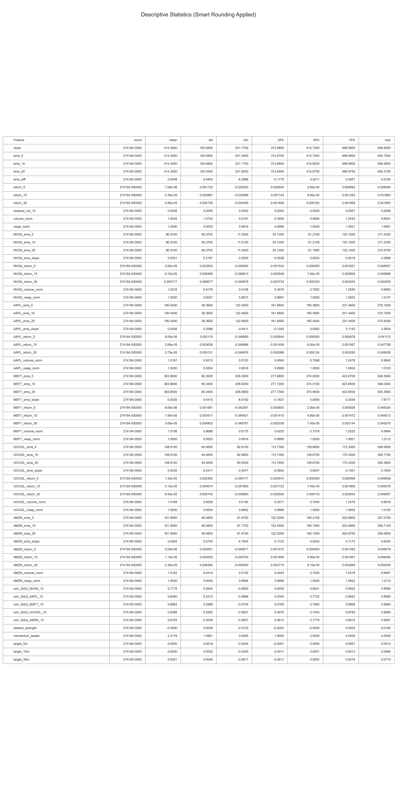
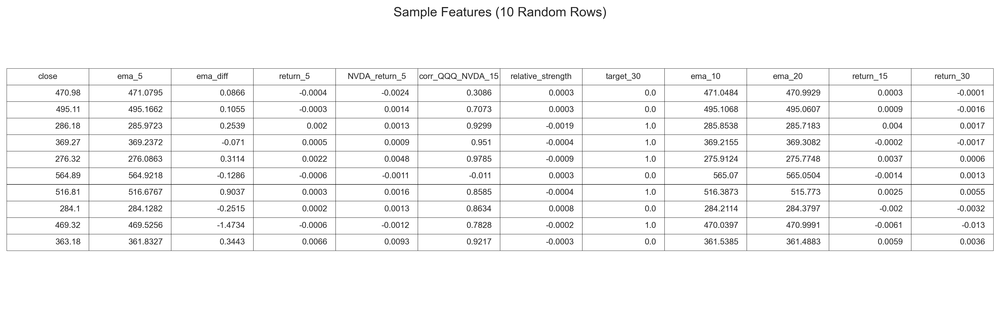

# Pre-Split Data Preparation Report

## 1. Data Preparation Process

### Feature Engineering
We prepared features using a **time-series aware approach** to prevent look-ahead bias.
- **Sorting**: Data was sorted by timestamp immediately after loading.
- **Calculations**: Features (EMAs, Rolling Stats) were calculated on the full dataset *before* splitting to ensure continuity at split boundaries.
- **Normalization**: Volume and VWAP were normalized relative to recent history (rolling 60min mean) to make them stationarity-friendly.

### Target Generation
Targets were generated as binary classifications:
- `1` if `Close[t+w] > Close[t]`
- `0` otherwise
- Windows: 5, 15, 30 minutes.

### Data Cleaning
- **Outliers**: Removed extreme returns (>5% in 5min) and unrealistic volume spikes (>10x avg).
- **Missing Values**: Used `ffill()` (Forward Fill) only. **No `bfill()`** was used to strictly prevent data leakage from the future.
- **Market Hours**: Filtered to 09:30 - 16:00 ET.

## 2. Parameters Used

- **Input Tickers**: QQQ (Target), NVDA, AAPL, MSFT, GOOGL, AMZN (Features)
- **Timeframe**: 1-Minute Bars
- **Feature Windows**: [5, 10, 20] minutes for EMAs
- **Target Windows**: [5, 15, 30] minutes
- **Train/Val/Test Split**:
    - Train: First 70%
    - Validation: Next 15%
    - Test: Last 15%

## 3. Descriptive Statistics

### Dataset Overview
- **Total Rows**: 274,521
- **Total Features**: 66

### Target Balance
- **5min Target**: 51.0% Upward / 49.0% Downward
- **15min Target**: 51.9% Upward / 48.1% Downward
- **30min Target**: 52.6% Upward / 47.4% Downward

### Split Distribution

| Split | Rows | Start Date | End Date | % of Total |
|-------|------|------------|----------|------------|
| Train | 192,164 | 2022-01-03 | 2024-11-18 | 70.0% |
| Val   | 41,178 | 2024-11-18 | 2025-06-03 | 15.0% |
| Test  | 41,179 | 2025-06-03 | 2025-11-21 | 15.0% |

### Feature Statistics

## 4. Samples

### Feature Sample (First 10 Rows)

## 5. Visualizations

### Feature Distributions & Correlations
*(See generated plots in `images/data_preparation/`)*

## 6. Findings & Feature Selection

### Selected Features
We selected features based on financial intuition and literature:
1.  **Trend**: EMAs (5, 10, 20) and EMA Slopes capture short-term momentum.
2.  **Volatility**: Realized Volatility (10m) captures market regime.
3.  **Volume**: Normalized volume indicates activity relative to recent history.
4.  **Cross-Asset**:
    - `relative_strength`: How QQQ performs vs. Top Tech.
    - `momentum_leader`: Which tech stock is leading the rally/drop.
    - `corr_QQQ_NVDA_15`: Dynamic correlation with the market leader.

### Key Observations
- **Stationarity**: Returns and normalized features are stationary, suitable for ML.
- **Balance**: Targets are well-balanced (~51-52% Up), slightly bullish bias typical for QQQ.
- **Data Quality**: Outlier removal reduced noise without losing significant data (<2% rows removed).

---
*Generated automatically by `03_reporting.py`*
